<p align="center">
  
</p>

<h1 align="center">Traces in. Agent quality out.</h1>
<h3 align="center">Evaluate AI agent behavior from OTel traces without re-running the agent.</h3>

<br/>

<p align="center">
  <a href="https://github.com/agentevals-dev/agentevals/stargazers"></a>
  &nbsp;
  <a href="https://pypi.org/project/agentevals-cli/"></a>
  &nbsp;
  <a href="https://discord.gg/cpveEn8Ah2"></a>
  &nbsp;
  <a href="LICENSE"></a>
</p>

<p align="center">
  <a href="#quick-start">Quick Start</a> · <a href="#installation">Install</a> · <a href="docs/">Docs</a> · <a href="#web-ui">Web UI</a> · <a href="https://discord.gg/cpveEn8Ah2">Discord</a> · <a href="#faq">FAQ</a> · <a href="CONTRIBUTING.md">Contributing</a>
</p>

---

## Why agentevals?

**agentevals scores pre-recorded and live OpenTelemetry traces instead.** Your agent runs once, and you evaluate the traces as many times as you want — different metrics, different eval sets, custom evaluators. Works with any OTel-instrumented framework (LangChain, Strands, Google ADK, and others).

- **No re-execution** — faster, cheaper, deterministic
- **Real-time visibility** — watch traces stream in as your agent runs, inspect tool calls and LLM interactions live in the browser
- **Framework-agnostic** — any agent that emits OTel spans
- **No cloud dependency** — everything runs locally
- **Extensible** — built-in metrics + custom evaluators in any language
- **Multiple interfaces** — CLI, Web UI, MCP server, REST API

---

## Quick Start

```bash
pip install agentevals-cli
```

Run an evaluation against a sample trace:

```bash
agentevals run samples/helm.json \
  --eval-set samples/eval_set_helm.json \
  -m tool_trajectory_avg_score
```

List available evaluators:

```bash
agentevals evaluator list
```

If you are working from a clone of this repo, use `uv run agentevals` instead.

---

## How It Works



1. **Record** — your agent runs and emits OTel traces (or you export from Jaeger)
2. **Load** — agentevals reads traces from files or a live OTLP stream
3. **Score** — built-in metrics, custom evaluators, and LLM judges score agent behavior
4. **Review** — see results in the CLI, Web UI, or through the MCP server

---

## Highlights

- **Zero-code integration** — point any OTel-instrumented agent at `localhost:4318` and traces stream to the UI in real-time. No SDK, no code changes.
- **Interactive Web UI** — upload traces, select metrics, inspect span trees, build eval sets visually, and watch live streaming sessions.
- **Custom evaluators in any language** — write scoring logic in Python, JavaScript, TypeScript, or anything that reads stdin and writes stdout. Scaffold with `agentevals evaluator init`.
- **Community evaluator registry** — share and reuse evaluators from GitHub with `type: remote` in your eval config.
- **MCP server** — let Claude Code, Cursor, or any MCP client run evaluations, inspect sessions, and compare against golden references from a conversation.
- **Claude Code skills** — `/eval` and `/inspect` slash commands for scoring and session debugging, built into this repo.

> [!IMPORTANT]
> This project is under active development. Expect breaking changes.

---

## Installation

**From PyPI** (recommended): the published package includes the **CLI**, **REST API**, and **embedded web UI**.

```bash
pip install agentevals-cli
```

Optional extras:

```bash
pip install "agentevals-cli[live]"        # MCP server support
```

**GitHub [releases](../../releases)** also ship **core** wheels (CLI and API only) and **bundle** wheels (with the embedded UI) if you need a specific version or offline `pip install ./path/to.whl`.

**From source** with `uv` or Nix:

```bash
uv sync
# or: nix develop .
```

See [DEVELOPMENT.md](DEVELOPMENT.md) for build instructions.

## Integration



### Zero-Code (Recommended)

Point any OTel-instrumented agent at the receiver. No SDK, no code changes:

```bash
# Terminal 1
agentevals serve --dev

# Terminal 2
export OTEL_EXPORTER_OTLP_ENDPOINT=http://localhost:4318
export OTEL_RESOURCE_ATTRIBUTES="agentevals.session_name=my-agent"
python your_agent.py
```

Traces stream to the UI in real-time. Works with LangChain, Strands, Google ADK, or any framework that emits OTel spans (`http/protobuf` and `http/json` supported). Sessions are auto-created and grouped by `agentevals.session_name`. Set `agentevals.eval_set_id` to associate traces with an eval set.

See [examples/zero-code-examples/](examples/zero-code-examples/) for working examples.

### SDK

For programmatic session lifecycle and decorator API:

```python
from agentevals import AgentEvals

app = AgentEvals()

with app.session(eval_set_id="my-eval"):
    agent.invoke("Roll a 20-sided die for me")
```

Requires `pip install "agentevals-cli[streaming]"`. See [examples/sdk_example/](examples/sdk_example/) for framework-specific patterns.

## CLI

```bash
# Single trace
agentevals run samples/helm.json \
  --eval-set samples/eval_set_helm.json \
  -m tool_trajectory_avg_score

# Multiple traces
agentevals run samples/helm.json samples/k8s.json \
  --eval-set samples/eval_set_helm.json \
  -m tool_trajectory_avg_score

# JSON output
agentevals run samples/helm.json \
  --eval-set samples/eval_set_helm.json \
  --output json

# List available evaluators (builtin + community)
agentevals evaluator list

# List only builtin evaluators
agentevals evaluator list --source builtin
```

## Custom Evaluators

Beyond the built-in metrics, you can write your own evaluators in Python, JavaScript, or any language. An evaluator is any program that reads JSON from stdin and writes a score to stdout.

```bash
agentevals evaluator init my_evaluator
```

This scaffolds a directory with boilerplate and a manifest. You can also list supported runtimes and generate config snippets:

```bash
agentevals evaluator runtimes           # show supported languages
agentevals evaluator config my_evaluator --path ./evaluators/my_evaluator.py
```

Implement your scoring logic, then reference it in an eval config:

```yaml
# eval_config.yaml
evaluators:
  - name: tool_trajectory_avg_score
    type: builtin

  - name: my_evaluator
    type: code
    path: ./evaluators/my_evaluator.py
    threshold: 0.7
```

```bash
agentevals run trace.json --config eval_config.yaml --eval-set eval_set.json
```

Community evaluators can be referenced directly from a shared GitHub repository using `type: remote`. See the [Custom Evaluators guide](docs/custom-evaluators.md) for the full protocol reference, SDK usage, and how to contribute evaluators.

## Web UI

**Installed bundle** (port 8001):

```bash
agentevals serve
```

**From source** (two terminals):

```bash
uv run agentevals serve --dev    # Terminal 1
cd ui && npm install && npm run dev             # Terminal 2 → http://localhost:5173
```

Upload traces and eval sets, select metrics, and view results with interactive span trees. Live-streamed traces appear in the "Local Dev" tab, grouped by session ID.

## REST API Reference

While the server is running, interactive API documentation is available at:

| Endpoint | Description |
|----------|-------------|
| [`/docs`](http://localhost:8001/docs) | Swagger UI with interactive request builder |
| [`/redoc`](http://localhost:8001/redoc) | ReDoc reference documentation |
| [`/openapi.json`](http://localhost:8001/openapi.json) | Raw OpenAPI 3.x schema (for code generation or CI) |

The OTLP receiver (port 4318) serves its own docs at `http://localhost:4318/docs`.

## MCP Server

Exposes evaluation tools to MCP clients. A `.mcp.json` at the project root lets Claude Code pick it up automatically.

| Tool | Requires `serve` | Description |
|------|:---:|-------------|
| `list_metrics` | yes | List available metrics |
| `evaluate_traces` | no | Evaluate local trace files (OTLP or Jaeger) |
| `list_sessions` | yes | List streaming sessions |
| `summarize_session` | yes | Structured summary of a session's tool calls |
| `evaluate_sessions` | yes | Evaluate sessions against a golden reference |

```bash
# Custom server URL (requires pip install "agentevals-cli[live]")
AGENTEVALS_SERVER_URL=http://localhost:9000 agentevals mcp
```

The React UI and MCP server share the same in-memory session state and can run simultaneously.

## Claude Code Skills

Two slash-command workflows in `.claude/skills/`, available automatically in this repo:

| Skill | What it does |
|-------|-------------|
| `/eval` | Score traces or compare sessions against a golden reference |
| `/inspect` | Turn-by-turn narrative of a live session with anomaly detection |

## Docs

| Guide | Description |
|-------|-------------|
| [Eval Set Format](docs/eval-set-format.md) | Schema, field reference, and examples for golden eval set JSON files |
| [Custom Evaluators](docs/custom-evaluators.md) | Write your own scoring logic in Python, JavaScript, or any language |
| [Live Streaming](docs/streaming.md) | Real-time trace streaming, dev server setup, and session management |
| [OpenTelemetry Compatibility](docs/otel-compatibility.md) | Supported OTel conventions, message delivery mechanisms, and OTLP receiver |

## Development

```bash
uv run pytest                      # run tests
uv run agentevals serve --dev      # backend
cd ui && npm run dev               # frontend (separate terminal)
```

See [DEVELOPMENT.md](DEVELOPMENT.md) for build tiers, Makefile targets, and Nix setup. To contribute, see [CONTRIBUTING.md](CONTRIBUTING.md).

## FAQ

**How does this compare to ADK's evaluations?**
Unlike ADK's LocalEvalService, which couples agent execution with evaluation, agentevals only handles scoring: it takes pre-recorded traces and compares them against expected behavior using metrics like tool trajectory matching, response quality, and LLM-based judgments.

However, if you're iterating on your agents locally, you can point your agents to agentevals and you will see rich runtime information in your browser. For more details, use the bundled wheel and explore the Local Development option in the UI.

**How does this compare to Bedrock AgentCore's evaluation?**
AgentCore's evaluation integration (via `strands-agents-evals`) also couples agent execution with evaluation. It re-invokes the agent for each test case, converts the resulting OTel spans to AWS's ADOT format, and scores them against 4 built-in evaluators (Helpfulness, Accuracy, Harmfulness, Relevance) via a cloud API call. This means you need an AWS account, valid credentials, and network access for every evaluation.

agentevals takes a different approach: it scores pre-recorded traces locally without re-running anything. It works with standard Jaeger JSON and OTLP formats from any framework, supports open-ended metrics (tool trajectory matching, LLM-based judges, custom scorers), and ships with a CLI, web UI, and MCP server. No cloud dependency required, though we do include all ADK's GCP-based evals as of now.
